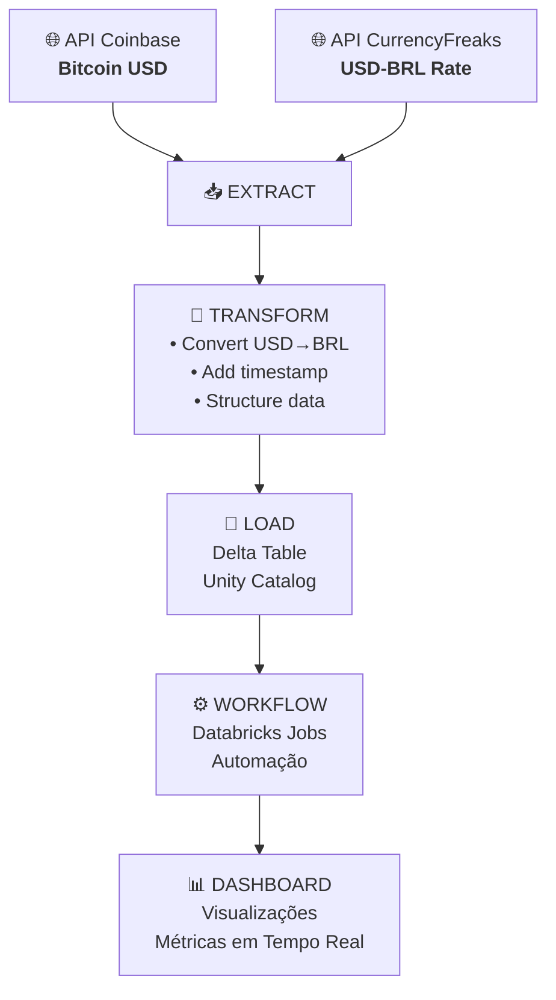

# Pipeline de Dados para Cotação do Bitcoin usando Python, SQL e Databricks

Este projeto tem como objetivo consumir uma API pública para obter a cotação atual do Bitcoin, realizando o processamento e armazenamento dos dados utilizando Python, SQL e Databricks. A solução demonstra uma pipeline de dados básica, desde a ingestão até a persistência das informações para análise.

## Arquitetura do Projeto

## Componentes do Projeto:

    📥 EXTRACT: Extração de dados de 2 APIs (Coinbase e CurrencyFreaks)
    🔄 TRANSFORM: Conversão de moedas e estruturação de dados
    💾 LOAD: Armazenamento em Delta Table no Unity Catalog
    ⚙️ WORKFLOW: Automação via Databricks Jobs & Pipelines
    📊 DASHBOARD: Visualização interativa com métricas e gráficos

## Job para automatização 

## Dashboard para visualização de resultados

